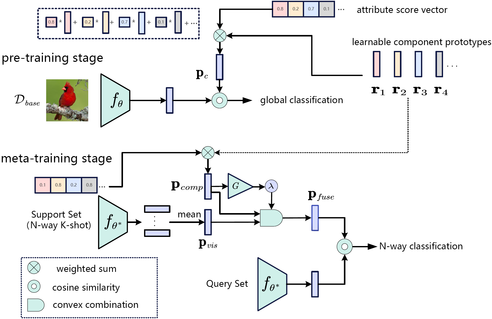

#### Compositional Prototypical Networks for Few-Shot Classification
For details see the [paper](https://arxiv.org/abs/2306.06584)

Official PyTorch implementation of **Compositional Prototypical Networks for Few-Shot Classification**

The paper has been accepted by **AAAI 2023**.
#### 0. Overview



#### 1. Requirements

- python 3.8.13
- pytorch 1.8.0

#### 2. Install

Clone this repository:

```shell
git clone https://github.com/fikry102/CPN.git
cd CPN
```

#### 3. Datasets

Datasets can be downloaded using [CUB and SUN GoogleDrive](https://drive.google.com/drive/folders/179xlyJxMccfNpFRDTiFTT-D_kX5Ahokg?usp=sharing)

We recommend the following structure to place the datasets:

---------------

|--data

​	||--cub

​	||--sun

|--CPN

---

#### 4.Run

```shell
cd scripts 

#CUB, pre-training
python 01_CUB_stage1.py

#CUB, 5way 1shot, meta-training and meta-testing 
python 01_CUB_stage2_5W1S.py

#CUB, 5way 5shot, meta-training and meta-testing
python 01_CUB_stage2_5W5S.py
```

or

```shell
sh run_cub.sh
```

#### 5. Models

We provide off-the-shelf models in [Models GoogleDrive](https://drive.google.com/drive/folders/19gOlHsBSFJCp5GB-tLytdf900U-9z3Rp?usp=sharing)

#### Acknowledgement

This repo is based on [SEGA](https://github.com/MartaYang/SEGA), [Dynamic Few-Shot Visual Learning without Forgetting](https://github.com/gidariss/FewShotWithoutForgetting) and [MetaOptNet](https://github.com/kjunelee/MetaOptNet).

Thanks for their wonderful works.

#### Contact
If you have any question about this project, please feel free to contact luqiang20@mails.ucas.ac.cn.
